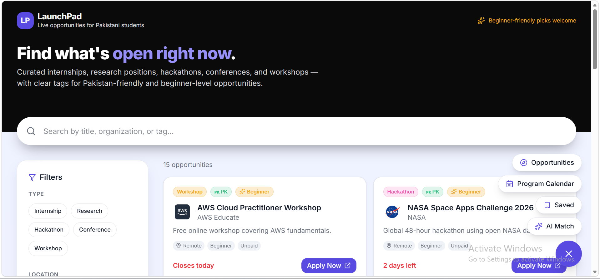

# LaunchPad — Live Opportunities for Pakistani Students

**Live app:** [https://launchpad-pakistan.lovable.app/](https://launchpad-pakistan.lovable.app/)
**Repository:** [https://github.com/dureadaaan/LaunchPad](https://github.com/dureadaaan/LaunchPad)
**Built by:** Dur e Adan (individual work)

---

# a. What It Does & The Problem It Solves

As a Computer Science student in Pakistan, I experienced this problem firsthand.

This summer, I spent weeks searching for internships, research programs, hackathons, conferences, and workshops. Instead of finding relevant opportunities, search engines repeatedly showed listings whose deadlines had already passed or opportunities that weren't actually open anymore. Even when I found active programs, many were designed exclusively for students from India, the US, Europe, or other regions, with little indication that Pakistani students were even eligible. I wasted countless hours opening websites, reading eligibility requirements, and discovering at the very end that I couldn't apply.

The problem goes beyond me—it's something thousands of Pakistani CS/IT students face every year.

Opportunities are scattered across university websites, company career pages, LinkedIn posts, Discord servers, Facebook groups, WhatsApp forwards, and newsletters. There is no single platform built specifically for Pakistani students. Existing opportunity portals are often India-focused or global, making it difficult to quickly identify opportunities that actually accept applicants from Pakistan.

As a result:

* **Students miss deadlines.** By the time they discover an opportunity, applications have already closed.
* **Eligibility is unclear.** Many global programs never clearly state whether Pakistani students can apply, forcing students to spend time researching each opportunity individually.
* **Beginners lose confidence.** First- and second-year students often assume every opportunity requires advanced skills, causing them to ignore beginner-friendly internships, research programs, and hackathons that they are actually eligible for.
* **Searching becomes frustrating.** Students spend more time hunting for opportunities than preparing strong applications.

I built **LaunchPad** to solve this problem.

LaunchPad is a centralized opportunity platform designed specifically for Pakistani CS/IT students. It brings internships, research positions, hackathons, conferences, workshops, scholarships, and competitions into one continuously updated platform. Every opportunity is categorized, searchable, and clearly labeled with information such as Pakistan eligibility, application deadlines, required experience level, and whether it is beginner-friendly.

Instead of making students search endlessly—and risking another missed deadline—LaunchPad helps them discover the right opportunities before applications close. An AI-powered recommendation system also encourages beginners to apply for opportunities that match their profile, helping them overcome the common belief that "I'm not experienced enough."

The goal is simple: **spend less time searching, never miss important deadlines, and give Pakistani students a platform built with their needs in mind—not as an afterthought, but as the primary focus.**

**Who it's for:** Pakistani CS/IT undergraduates (primarily 2nd–4th year), with particular attention to beginners and juniors who tend to filter themselves out of applying.

---

## b. Live URL

🔗 **[https://launchpad-pakistan.lovable.app/](https://launchpad-pakistan.lovable.app/)**

No login or signup required to browse. Saving opportunities only requires an email address (no password).

---

## c. Features

**Opportunity Feed**
- Live-queried grid of currently active opportunities (any opportunity whose deadline has passed is automatically filtered out of every view — no manual cleanup, enforced directly in the data query)
- Each card shows: type badge (color-coded by category), Pakistan-friendly badge, beginner-friendly badge, organization logo, relative deadline countdown (highlighted red when 7 days or fewer remain), location type, skill level, paid/unpaid status, and a direct "Apply Now" button linking to the official application page

**Search & Filters**
- Free-text search across title, organization, description, and tags
- Filter by Type (Internship / Research / Hackathon / Conference / Workshop), Location (Remote / Onsite–Pakistan / Onsite–Global), Skill Level (Beginner / Intermediate / Advanced), Paid/Unpaid, and Deadline window (next 7 / next 30 days)
- Filters combine (AND logic) and can be cleared individually or all at once

**Opportunity Details Page**
- Full opportunity view with description and a prominent Apply Now button
- *(Eligibility criteria field exists in the data model and is populated for some listings, but is not yet surfaced on this page — noted as a near-term improvement below.)*

**AI Match**
- A dedicated matching page where a student describes their skills/interests in free text and selects an experience level
- Returns ranked opportunity matches with a confidence score and a short explanation of fit, with special handling for beginners (see section d below)

**Program Calendar**
- A year-at-a-glance view of the internationally renowned, recurring annual programs students specifically wait for: Google Summer of Code, Microsoft Imagine Cup, Google STEP Internship, Microsoft Internship, Amazon SDE Internship, Outreachy, and the MLH Fellowship
- Organized into 12 month-cards; each program appears under the month its application window typically opens
- Clicking a program shows its full annual timeline (Applications / Selection / Results) and a direct Apply link
- These entries are intentionally always visible regardless of whether the current year's specific deadline has passed, since they're recurring programs students track year over year — distinct from the main feed's real-time expiry behavior

**Save/Bookmark**
- Lightweight, email-only saving — no password, no full account system
- A dedicated Saved page retrieves all opportunities bookmarked under a given email

**Global Navigation**
- A persistent floating action button (FAB), present on every page, expands into quick links to Home, Calendar, and Saved

---

## d. The AI Feature

**What it does:** On the AI Match page, a student describes their skills and interests in their own words and selects an experience level (Beginner / Intermediate / Advanced). The app sends this input, along with the current list of active opportunities, to an AI model, which returns a ranked shortlist of the best-fit opportunities — each with a confidence score and a one-line reason for the match.

**The deliberate design choice — and the actual product insight behind this project:** most opportunity boards implicitly favor advanced students, because the most visible/prestigious listings tend to be competitive ones. A junior with limited experience sees a page full of "advanced" requirements and quietly gives up. LaunchPad's matching prompt explicitly counteracts this: when a student's stated level is "beginner," or their described skills sound uncertain or limited, the model is instructed to prioritize genuinely beginner-friendly opportunities and add a short, specific, encouraging note — not generic praise, but something that validates a realistic next step.

**System prompt :**

```
You are the matching engine for LaunchPad, a platform helping Pakistani
CS/IT students find internships, research positions, hackathons,
conferences, and workshops.

You will receive: a student's self-described skills/interests (free text),
their experience level (beginner, intermediate, or advanced), and a list
of currently active opportunities (each with title, type, skill_level,
location_type, pakistan_friendly, paid, and description).

First, check whether the student's input actually describes technical skills, interests, career goals, or areas they want to learn. If the input is unrelated to this (for example, a homework question, a request for unrelated help, random text, or anything that isn't a description of skills/interests), do NOT attempt to match it against opportunities. Instead, return an empty array for matches and a top-level message field saying: 'That doesn't look like a skills or interests description — try telling me what you're learning, interested in, or want to get better at.' Only proceed to matching if the input is a genuine skills/interests description.

Your task: rank the opportunities by how well they fit this student, and
return the top 5-8 matches as a JSON array. For each match, include:
- "opportunity_id": the id of the matched opportunity
- "confidence_score": an integer 0-100 representing fit quality
- "reason": one short sentence (max 20 words) explaining why it fits

Critical instruction for beginners: if the student's stated level is
"beginner" OR their described skills sound uncertain/limited (e.g. "just
started learning," "not sure what I know," "only done basic projects"),
you MUST prioritize opportunities tagged skill_level "beginner" and
explicitly avoid ranking "advanced" opportunities highly even if their
subject matter matches. For these students, add a short, genuinely
encouraging note (max 15 words) in a "note" field for at least the top 2
matches — something that validates their potential rather than generic
praise, e.g. "Great starting point — no prior experience required here."

If no opportunities are a strong fit, return an empty array rather than
forcing weak matches, and include a top-level "message" field with a kind,
encouraging suggestion (e.g. "Nothing quite matches yet — try broadening
your interests or check back soon.").

Respond ONLY with valid JSON. No preamble, no markdown formatting, no
explanation outside the JSON structure.
```

**Model/provider:** Lovable's built-in AI integration (backed by Google and OpenAI models), called securely from a server-side function — no API key is ever exposed to the browser.

---

## e. Tools, Services, and Models Used

| Category | Choice |
|---|---|
| App builder | [Lovable](https://lovable.dev) |
| Frontend framework | React + Vite + TypeScript |
| Routing | TanStack Router |
| Data fetching | TanStack Query |
| Styling | Tailwind CSS |
| Database & backend | Lovable Cloud (Supabase-based Postgres, with edge functions) |
| AI feature | Lovable's built-in AI integration (Google / OpenAI models) |
| Hosting / deployment | Lovable's built-in publishing (live at launchpad-pakistan.lovable.app) |
| Version control | Git + GitHub (public repository) |
| Logo images | Google's favicon service (`google.com/s2/favicons`), driven by a `logo_url` field per opportunity in the database |
| Planning assistance | Claude (Anthropic) — used throughout the build process for architecture planning, prompt drafting for Lovable, SQL authoring, and debugging guidance |

---

## f. Screenshots

*(Add at least 3 screenshots here before submitting — recommended: the main feed with real opportunities and logos visible, the Program Calendar view, and the AI Match results page. Save them into a folder such as `/screenshots` in this repo and reference them like the example below.)*

```markdown



```

---

## g. How to Run This Project

This project was built and is managed through [Lovable](https://lovable.dev), which handles hosting and the database (Lovable Cloud) directly — there is no separate local backend to stand up.

**To view the live app:** simply visit [https://launchpad-pakistan.lovable.app/](https://launchpad-pakistan.lovable.app/) — no setup required.

**To run the frontend code locally:**

```bash
git clone https://github.com/dureadaaan/LaunchPad.git
cd LaunchPad
npm install
npm run dev
```

The app expects a `.env` file at the project root with the following (Supabase connection values — see note below on why these are safely included):

```
SUPABASE_PROJECT_ID=your-project-id
SUPABASE_PUBLISHABLE_KEY=your-publishable-key
SUPABASE_URL=your-project-url
VITE_SUPABASE_PROJECT_ID=your-project-id
VITE_SUPABASE_PUBLISHABLE_KEY=your-publishable-key
VITE_SUPABASE_URL=your-project-url
```

Then open `http://localhost:5173` (or whichever port Vite reports).

---

## Data Notes & Known Limitations

- **Curated, not live-scraped:** Opportunities are researched and entered manually (with some seeded during initial development), not pulled via a live scraper — this was a deliberate scope decision to prioritize a working, reliable feature set within the build timeline over a fragile scraping pipeline. Expiry, however, is fully automatic: any opportunity whose deadline has passed is filtered out of every view by a real date comparison in the database query, not manual cleanup.
- **~22 opportunities** are currently in the live database, spanning internships, research, hackathons, conferences, and workshops, plus the 7 flagship recurring programs on the Calendar page.
- **No password-based accounts.** Bookmarking is intentionally email-only, a deliberate scope decision to avoid the complexity of a full auth system in favor of shipping a complete, working core experience.
- **Eligibility criteria** exist as a data field and are populated for the Calendar's flagship programs, but are not yet displayed on the opportunity details page — a natural next addition.
- **On the `.env` file in this repository:** it contains only the Supabase project URL and the *publishable* (anon) key — not a `service_role` key or any paid API key. Per Supabase's own security model, these specific values are meant to be public (they're already visible in any deployed app's browser bundle) — actual data access is governed by Row Level Security policies on the database tables, not by keeping this key secret. No sensitive credentials are committed anywhere in this repository.

---

Built for CS/IT students across Pakistan. Deadlines refreshed regularly. 🇵🇰
